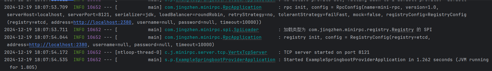
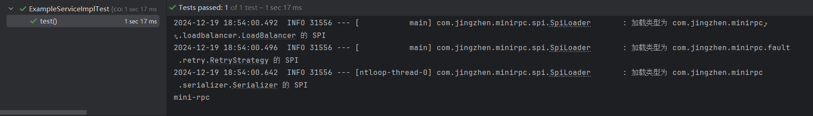
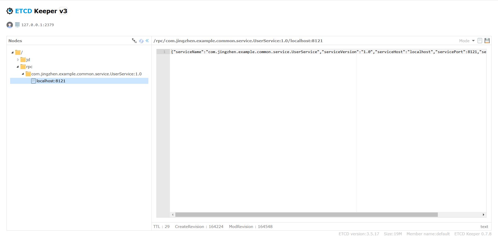

# Mini RPC 框架
## 项目介绍
基于 Java + Etcd + Vert.x 的高性能 RPC 框架。

## 测试步骤
本项目只是练手，不建议大家在自己的项目中使用本框架。

1. 下载etcd并安装：https://github.com/etcd-io/etcd/releases
2. 启动etcd.exe。
3. 运行example-springboot-provider中的ExampleSpringbootProviderApplication类中的main方法。

5. 运行example-springboot-consumer中的ExampleServiceImplTest类中的test方法。

6. 若consumer输出“mini-rpc”，provider输出“用户名：mini-rpc”，则测试成功。

ps：可以遵循下述步骤使用etcdkeeper来查看etcd中注册的服务信息：
1. 下载etcdkeep：https://github.com/evildecay/etcdkeeper/
2. 启动etcdkeeper.exe。
3. 访问http://127.0.0.1:8080/etcdkeeper/即可。
